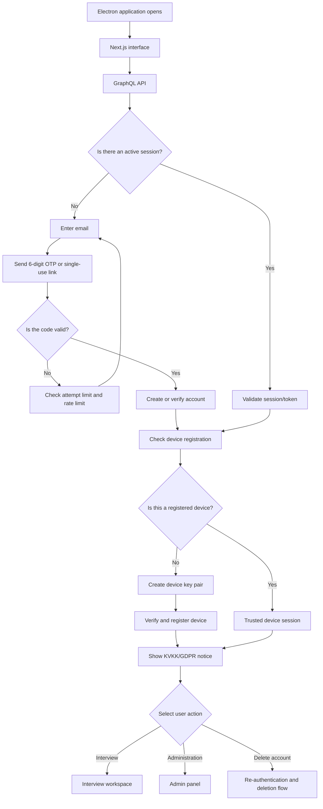

# 01 — Authentication, Device, and Account Flow

```mermaid
flowchart TD
    A["Electron application opens"] --> B["Next.js interface"]
    B --> C["GraphQL API"]
    C --> D{"Is there an active session?"}

    D -->|"No"| E["Enter email"]
    E --> F["Send 6-digit OTP or single-use link"]
    F --> G{"Is the code valid?"}
    G -->|"No"| H["Check attempt limit and rate limit"]
    H --> E
    G -->|"Yes"| I["Create or verify account"]

    D -->|"Yes"| J["Validate session/token"]
    I --> K["Check device registration"]
    J --> K

    K --> L{"Is this a registered device?"}
    L -->|"No"| M["Create device key pair"]
    M --> N["Verify and register device"]
    L -->|"Yes"| O["Trusted device session"]
    N --> P["Show KVKK/GDPR notice"]
    O --> P

    P --> Q{"Select user action"}
    Q -->|"Interview"| R["Interview workspace"]
    Q -->|"Administration"| S["Admin panel"]
    Q -->|"Delete account"| T["Re-authentication and deletion flow"]
```

