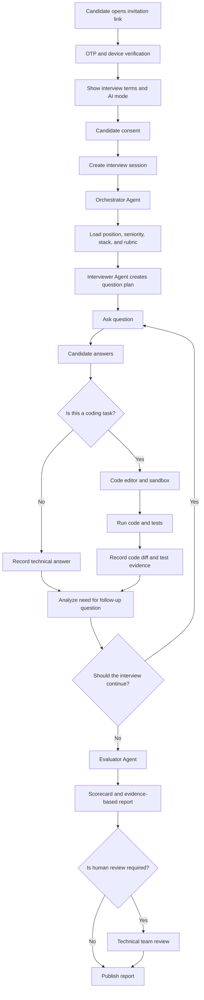

# 02 — Technical Interview Agent Flow

```mermaid
flowchart TD
    A["Candidate opens invitation link"] --> B["OTP and device verification"]
    B --> C["Show interview terms and AI mode"]
    C --> D["Candidate consent"]
    D --> E["Create interview session"]
    E --> F["Orchestrator Agent"]

    F --> G["Load position, seniority, stack, and rubric"]
    G --> H["Interviewer Agent creates question plan"]
    H --> I["Ask question"]
    I --> J["Candidate answers"]
    J --> K{"Is this a coding task?"}

    K -->|"No"| L["Record technical answer"]
    K -->|"Yes"| M["Code editor and sandbox"]
    M --> N["Run code and tests"]
    N --> O["Record code diff and test evidence"]

    L --> P["Analyze need for follow-up question"]
    O --> P
    P --> Q{"Should the interview continue?"}
    Q -->|"Yes"| I
    Q -->|"No"| R["Evaluator Agent"]
    R --> S["Scorecard and evidence-based report"]
    S --> T{"Is human review required?"}
    T -->|"Yes"| U["Technical team review"]
    T -->|"No"| V["Publish report"]
    U --> V
```

