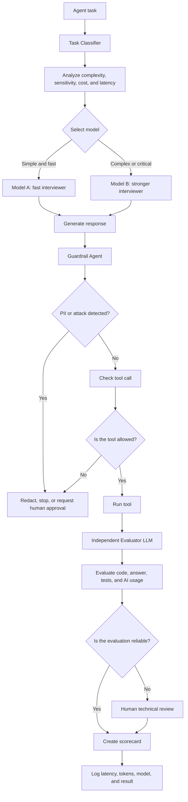

# 03 — LLM Router and Evaluation Flow

```mermaid
flowchart TD
    A["Agent task"] --> B["Task Classifier"]
    B --> C["Analyze complexity, sensitivity, cost, and latency"]
    C --> D{"Select model"}

    D -->|"Simple and fast"| E["Model A: fast interviewer"]
    D -->|"Complex or critical"| F["Model B: stronger interviewer"]
    E --> G["Generate response"]
    F --> G

    G --> H["Guardrail Agent"]
    H --> I{"PII or attack detected?"}
    I -->|"Yes"| J["Redact, stop, or request human approval"]
    I -->|"No"| K["Check tool call"]
    K --> L{"Is the tool allowed?"}
    L -->|"No"| J
    L -->|"Yes"| M["Run tool"]

    M --> N["Independent Evaluator LLM"]
    N --> O["Evaluate code, answer, tests, and AI usage"]
    O --> P{"Is the evaluation reliable?"}
    P -->|"No"| Q["Human technical review"]
    P -->|"Yes"| R["Create scorecard"]
    Q --> R
    R --> S["Log latency, tokens, model, and result"]
```

