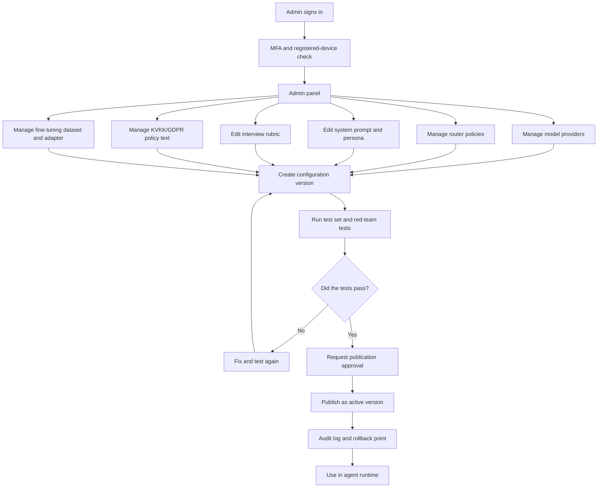

# 04 — Admin LLM Management

```mermaid
flowchart TD
    A["Admin signs in"] --> B["MFA and registered-device check"]
    B --> C["Admin panel"]

    C --> D["Manage model providers"]
    C --> E["Manage router policies"]
    C --> F["Edit system prompt and persona"]
    C --> G["Edit interview rubric"]
    C --> H["Manage KVKK/GDPR policy text"]
    C --> I["Manage fine-tuning dataset and adapter"]

    D --> J["Create configuration version"]
    E --> J
    F --> J
    G --> J
    H --> J
    I --> J

    J --> K["Run test set and red-team tests"]
    K --> L{"Did the tests pass?"}
    L -->|"No"| M["Fix and test again"]
    M --> J
    L -->|"Yes"| N["Request publication approval"]
    N --> O["Publish as active version"]
    O --> P["Audit log and rollback point"]
    P --> Q["Use in agent runtime"]
```

