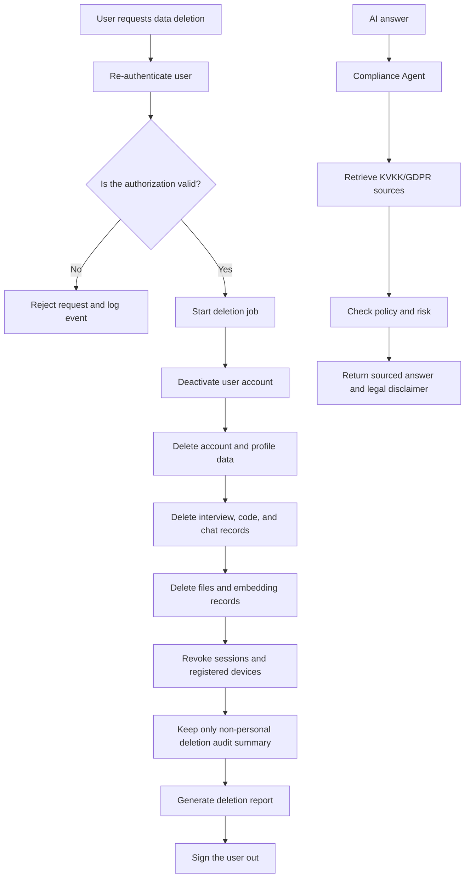

# 05 — KVKK/GDPR and Data Deletion

```mermaid
flowchart TD
    A["User requests data deletion"] --> B["Re-authenticate user"]
    B --> C{"Is the authorization valid?"}
    C -->|"No"| D["Reject request and log event"]
    C -->|"Yes"| E["Start deletion job"]

    E --> F["Deactivate user account"]
    F --> G["Delete account and profile data"]
    G --> H["Delete interview, code, and chat records"]
    H --> I["Delete files and embedding records"]
    I --> J["Revoke sessions and registered devices"]
    J --> K["Keep only non-personal deletion audit summary"]
    K --> L["Generate deletion report"]
    L --> M["Sign the user out"]

    N["AI answer"] --> O["Compliance Agent"]
    O --> P["Retrieve KVKK/GDPR sources"]
    P --> Q["Check policy and risk"]
    Q --> R["Return sourced answer and legal disclaimer"]
```

