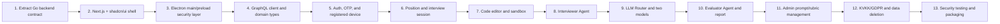

# 06 — MVP Development Order

```mermaid
flowchart LR
    A["1. Extract Go backend contract"] --> B["2. Next.js + shadcn/ui shell"]
    B --> C["3. Electron main/preload security layer"]
    C --> D["4. GraphQL client and domain types"]
    D --> E["5. Auth, OTP, and registered device"]
    E --> F["6. Position and interview session"]
    F --> G["7. Code editor and sandbox"]
    G --> H["8. Interviewer Agent"]
    H --> I["9. LLM Router and two models"]
    I --> J["10. Evaluator Agent and report"]
    J --> K["11. Admin prompt/rubric management"]
    K --> L["12. KVKK/GDPR and data deletion"]
    L --> M["13. Security testing and packaging"]
```

